# 🚗 Uber Request Data — EDA & Analytics Project

> **BCA (AI & ML) | Jaipur National University | Internship Data Analytics Project**  
> Complete Exploratory Data Analysis on Uber ride request data (2016) using Python, SQL, and Excel.

---

## 📌 Project Overview

This project performs a full **Exploratory Data Analysis (EDA)** on Uber ride request data to identify demand-supply gaps, understand customer request patterns, analyze trip completion rates, and uncover operational bottlenecks affecting ride fulfillment.

**The analysis focuses on:**
- Request trends across hours and weekdays
- Pickup point behaviour (City vs Airport)
- Ride completion and cancellation patterns
- Driver availability issues
- Time-slot based demand analysis
- Trip duration statistics

---

## 🎯 Business Problem

Uber experiences situations where customer ride requests cannot be fulfilled due to:
- Driver cancellations
- No available cars
- Demand exceeding supply

**Goal:** Identify *when*, *where*, and *why* these failures happen — and recommend fixes.

---

## 📁 Repository Structure

```
Data-Analyst-/
│
├── Uber Request Data.csv       # Raw dataset
├── Uber_Analytics.xlsx         # Processed analytics workbook
├── EDA.py                      # Python EDA script (Pandas + Seaborn)
├── sql_insights.sql            # SQL queries for business insights (DuckDB)
│
├── Figure_.png                 # Status Distribution
├── Figure_1.png                # Requests by Hour
├── Figure_2.png                # Requests by Day
├── Figure_3.png                # Pickup Point Distribution
├── Figure_4.png                # Status by Pickup Point
├── Figure_5.png                # Status Across Time Slots
├── Figure_7.png                # Trip Duration Distribution
├── Figure_8.png                # Trip Duration Outliers
├── Figure_9.png                # Missing Values Heatmap
├── Figure_10.png               # No Cars Available by Hour
├── Figure_541.png              # Completion Rate by Hour
│
└── README.md
```

---

## 📊 Dataset Overview

| Column | Description |
|---|---|
| `Request id` | Unique ride request identifier |
| `Pickup point` | Origin — `City` or `Airport` |
| `Driver id` | Assigned driver (nullable) |
| `Status` | `Trip Completed`, `Cancelled`, `No Cars Available` |
| `Request timestamp` | Date & time of request |
| `Drop timestamp` | Date & time of drop-off (nullable) |

**Total Records:** ~6,745 requests | **Period:** 5 weekdays (Monday–Friday)

---

## ⚙️ Feature Engineering

| New Feature | Logic |
|---|---|
| `Hour` | Extracted from `Request timestamp` |
| `Date` | Date portion of request |
| `Day` | Weekday name |
| `Trip Duration (mins)` | `(Drop timestamp − Request timestamp)` in minutes |
| `Time Slot` | Hour bucketed into 5 business-friendly periods |

**Time Slot Definitions:**

| Time Slot | Hours |
|---|---|
| Morning Rush | 4 AM – 9 AM |
| Late Morning | 9 AM – 12 PM |
| Afternoon | 12 PM – 5 PM |
| Evening Rush | 5 PM – 10 PM |
| Late Night | 10 PM – 4 AM |

---

## 📈 Key Findings & Visualizations

### 1. Status Distribution
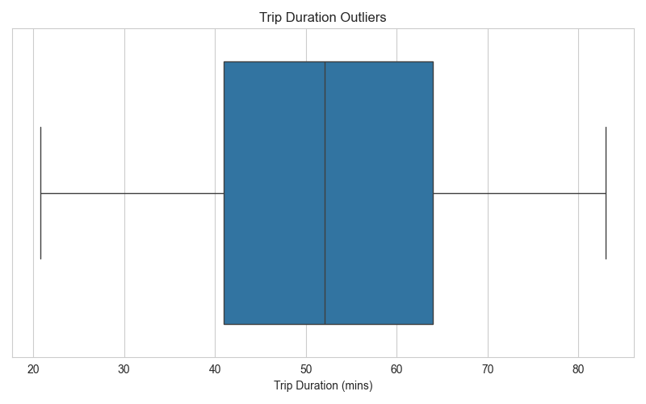

- ~42% trips completed, ~39% had no cars available, ~19% cancelled
- **Only 42% of ride requests are fulfilled** — a critical operational gap

---

### 2. Requests by Hour
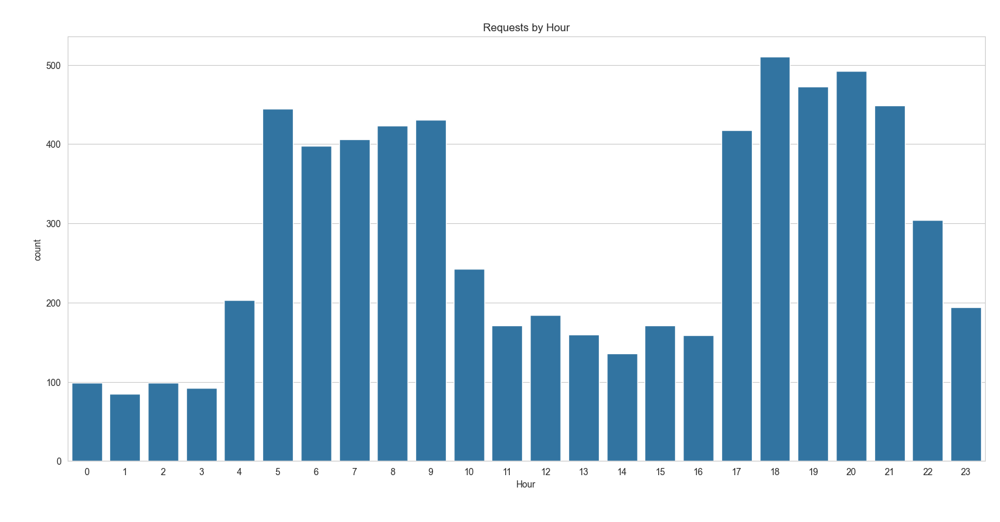

- Two clear demand peaks: **Morning Rush (5–9 AM)** and **Evening Rush (5–9 PM)**
- Lowest demand between 1–3 AM

---

### 3. Requests by Day
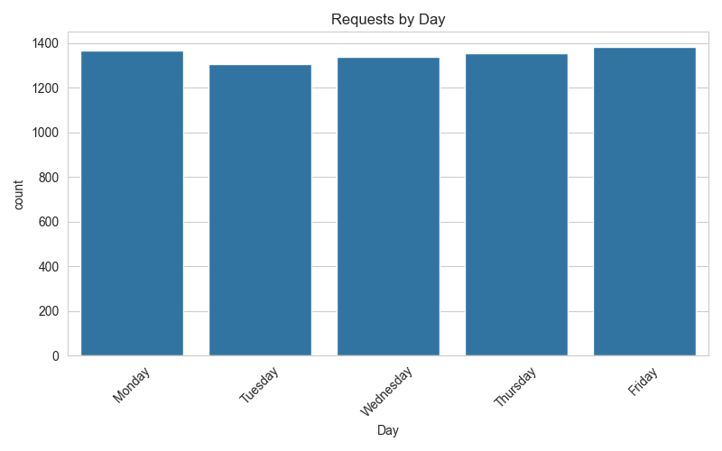

- Demand is **consistent across all weekdays** (~1,300–1,380 requests/day)
- No single day is an outlier

---

### 4. Pickup Point Distribution
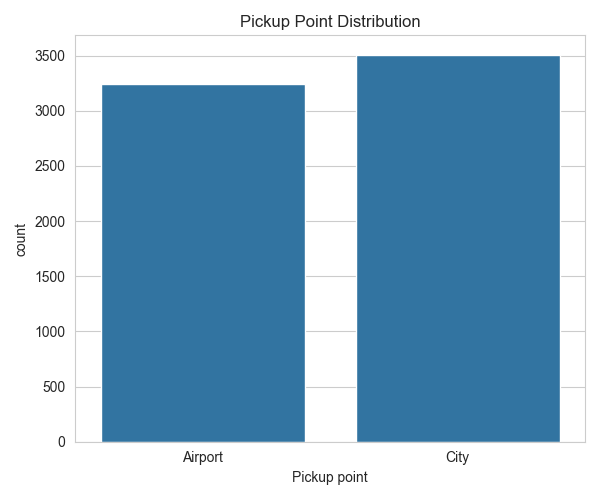

- City (3,500) slightly exceeds Airport (3,200) in total requests

---

### 5. Status by Pickup Point
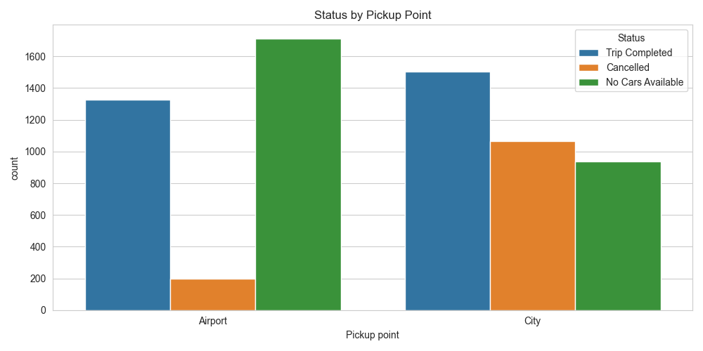

- **Airport:** Dominated by "No Cars Available" (~1,700 cases) — severe supply gap
- **City:** Dominated by cancellations (~1,060 cases) — driver-side friction

---

### 6. Status Across Time Slots
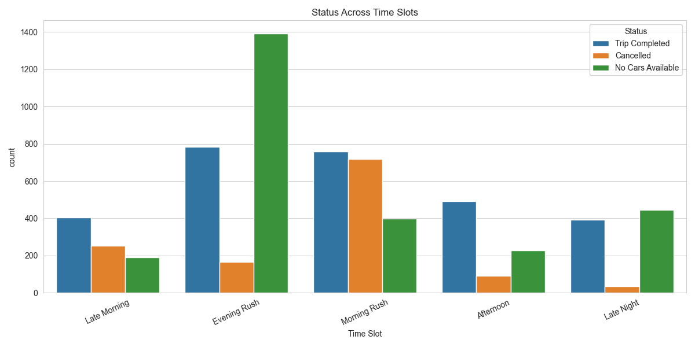

- **Evening Rush** has ~1,400 "No Cars Available" cases — the worst time slot by far
- **Morning Rush** has the highest cancellation count (~720)

---

### 7. Trip Duration Distribution
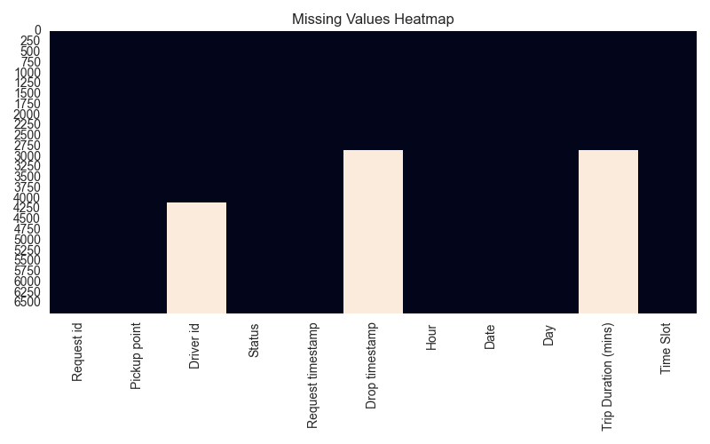

- Completed trips range from ~20 to ~83 minutes
- Distribution is roughly uniform between 30–75 mins

---

### 8. Trip Duration Outliers
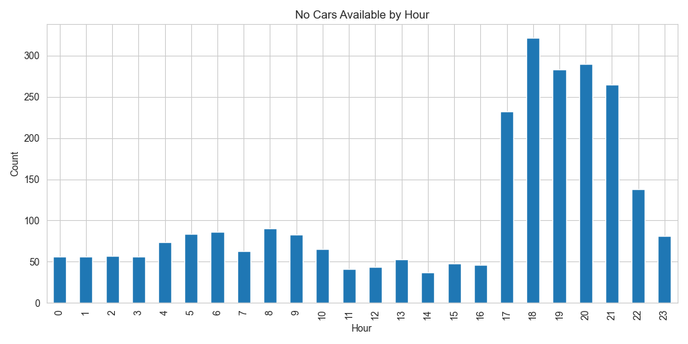

- Box plot shows very few extreme outliers — dataset is relatively clean
- IQR spans approximately 42–64 minutes

---

### 9. Missing Values Heatmap
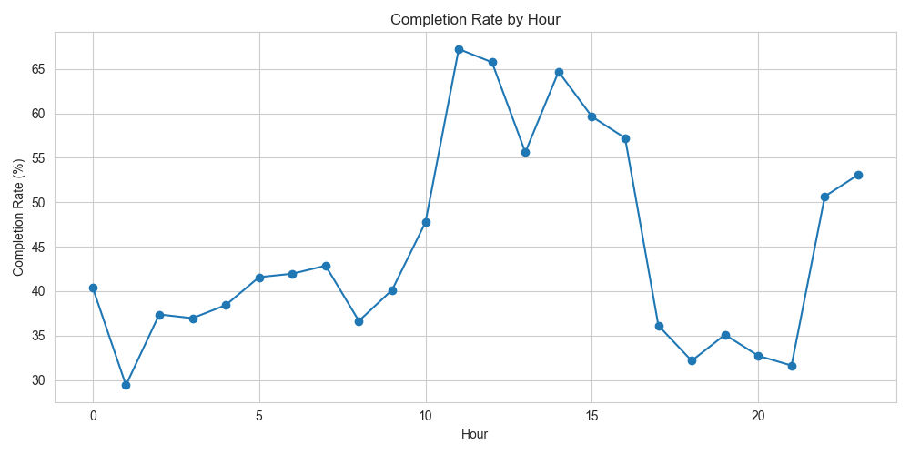

- `Driver id`: ~4,200 nulls (expected — no driver assigned for failed requests)
- `Drop timestamp` & `Trip Duration`: ~3,000 nulls (non-completed trips)

---

### 10. No Cars Available by Hour
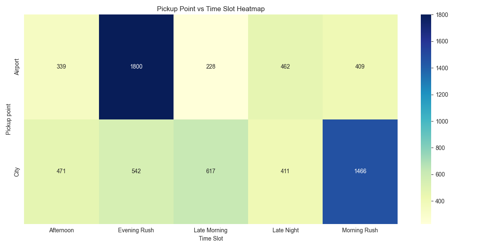

- Severe shortage between **5 PM – 9 PM** (peak: 320+ cases at 6 PM)
- Morning hours show moderate, manageable shortages

---

### 11. Completion Rate by Hour
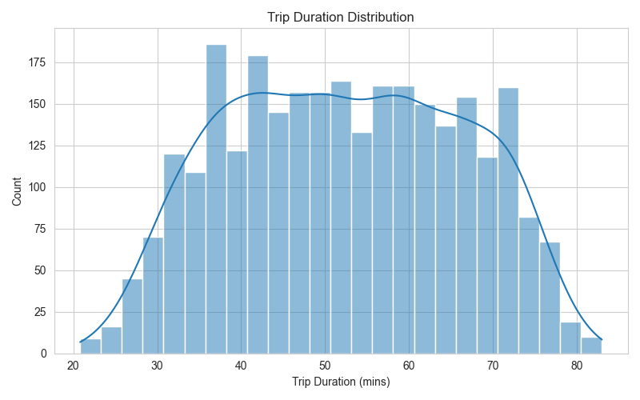

- Peaks at **~67% around 11 AM–12 PM** (mid-day efficiency window)
- Drops to **~31% at 9–10 PM** — Evening Rush overwhelms supply

---

## 🔍 SQL Insights (DuckDB)

The `sql_insights.sql` file contains **10 business queries:**

1. Overall request status breakdown with % share
2. Fulfilment rate by pickup point
3. Peak demand hours
4. Time slot performance (completed / no cars / cancelled)
5. Daily demand trend with completion rate
6. Average trip duration by pickup point
7. Most active drivers (top 10) with cancellation rates
8. Gap analysis — supply vs demand by hour (LOW / MODERATE / HIGH / CRITICAL labels)
9. Airport inbound vs outbound problem (no-car rate by pickup × time slot)
10. Rolling 3-hour demand window

---

## 💡 Business Recommendations

| # | Problem | Recommendation |
|---|---|---|
| 1 | No cars at Airport during Evening Rush | Increase driver incentives near airport from 5–10 PM |
| 2 | High City cancellations during Morning Rush | Introduce cancellation penalties; restructure incentives |
| 3 | Overall Evening demand-supply gap | Deploy surge pricing + dynamic driver allocation |
| 4 | Mid-day efficiency window underutilised | Schedule driver training/breaks during 11 AM–2 PM |

---

## 🛠️ Tech Stack

| Tool | Purpose |
|---|---|
| Python 3.x | Core analysis |
| Pandas | Data wrangling & feature engineering |
| Seaborn / Matplotlib | Visualizations |
| DuckDB | In-process SQL analytics |
| Excel (.xlsx) | Summary analytics workbook |

---

## ▶️ How to Run

### Python EDA

```bash
# Clone the repository
git clone https://github.com/pardeep0011/Data-Analyst-.git
cd Data-Analyst-

# Install dependencies
pip install pandas numpy matplotlib seaborn

# Run EDA
python EDA.py
```

### SQL Insights (DuckDB)

```bash
pip install duckdb
```

```python
import duckdb

con = duckdb.connect()
con.execute("CREATE TABLE uber AS SELECT * FROM read_csv_auto('Uber Request Data.csv')")

# Example query
print(con.execute("SELECT Status, COUNT(*) FROM uber GROUP BY Status").df())
```

---

## 👨‍💻 Author

**Pardeep**  
BCA (AI & ML) — Jaipur National University  
🔗 [GitHub](https://github.com/pardeep0011)

---

## 📄 License

This project is licensed under the **GPL-3.0 License** — see the [LICENSE](LICENSE) file for details.

---

⭐ *If you found this project useful, consider giving it a star!*
